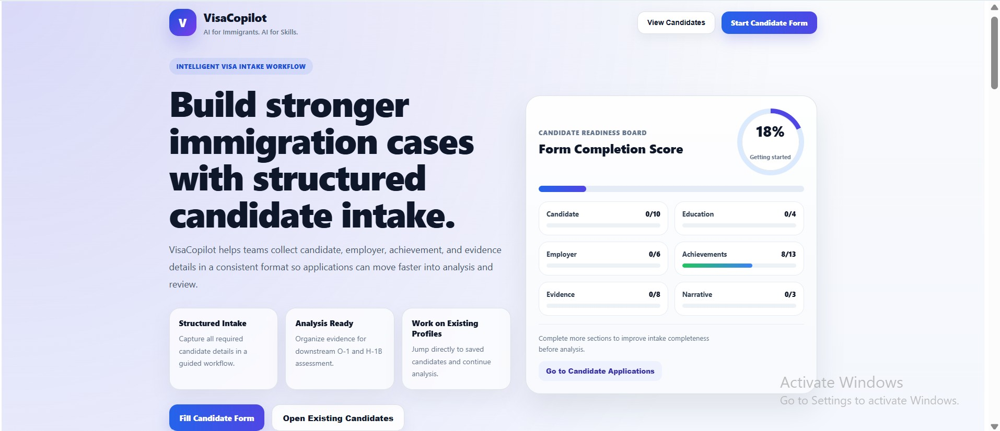

# VisaCopilot

AI-Powered Immigration Analysis System using RAG & LLMs

---

## 🚀 Overview

VisaCopilot is an AI-driven decision-support system designed to evaluate O-1 and H-1B visa eligibility by combining structured candidate data, Retrieval-Augmented Generation (RAG), and LLM-based reasoning.

The immigration process for high-skill visas is often complex, expensive, and unclear. Candidates lack a reliable way to assess their profile strength before investing significant time and legal costs. VisaCopilot addresses this by transforming unstructured immigration policies into actionable insights using AI.

The system integrates:

* 🧑‍💻 Structured Candidate Intake (Frontend UI)
* ⚡ FastAPI Backend (Orchestration Layer)
* 🧠 RAG Pipeline (Policy Retrieval + Context Injection)
* 🤖 Ollama LLMs (LLaMA / Mistral / Gemma)
* 🔎 Policy Knowledge Base (USCIS Documents)
* 📊 Explainable Scoring & Recommendations

The platform analyzes candidate profiles, maps them to USCIS criteria, retrieves relevant policy context, and generates a structured evaluation including readiness score, strengths, gaps, and next steps.

---

## 🏗 Architecture

---

## 🔬 Methodology & Operations

The VisaCopilot system follows a modular AI pipeline architecture designed for explainability, scalability, and grounded reasoning.

* The process begins with a structured candidate intake through a React-based frontend, where user inputs such as publications, awards, leadership roles, and contributions are captured and normalized into machine-readable formats aligned with USCIS criteria.

* The FastAPI backend acts as the orchestration layer, receiving candidate data and triggering the analysis workflow. It ensures proper routing of data between different components and maintains system-level control over execution.

* A Retrieval-Augmented Generation (RAG) pipeline is used to ground the analysis in real immigration policy. USCIS documents are preprocessed into chunks, embedded, and stored for retrieval. During analysis, the system queries this knowledge base to fetch the most relevant policy context for each evaluation criterion.

* The retrieved context is passed into the LLM reasoning layer powered by Ollama. The model operates under controlled prompt structures to ensure outputs are structured, policy-aligned, and explainable rather than free-form generation.

* A copilot logic layer synthesizes the final output by combining candidate data and LLM reasoning to generate a readiness score, strengths, gaps, required supporting documents, and actionable recommendations.

* The system is designed with scalability in mind, supporting containerized deployment and future integration with cloud infrastructure. Logging, observability, and secure configuration management are considered for production readiness.

This layered separation of intake, retrieval, reasoning, and decision-making ensures that the system remains transparent, auditable, and extensible for real-world use.

---

## 📌 Future Improvements

* Expand dataset with real-world immigration case outcomes for better evaluation

* Fine-tune LLMs on domain-specific immigration data for improved accuracy

* Enhance RAG pipeline with advanced chunking and hierarchical retrieval

* Add document upload and automated evidence extraction

* Introduce multi-visa support (EB1, EB2-NIW, etc.)

* Implement feedback loops for continuous learning and system improvement

* Deploy on cloud infrastructure (AWS / Azure) with secure access control

---

## ⚠️ Disclaimer

This system is intended for informational and decision-support purposes only and does not constitute legal advice. Users should consult an immigration attorney for official guidance.
