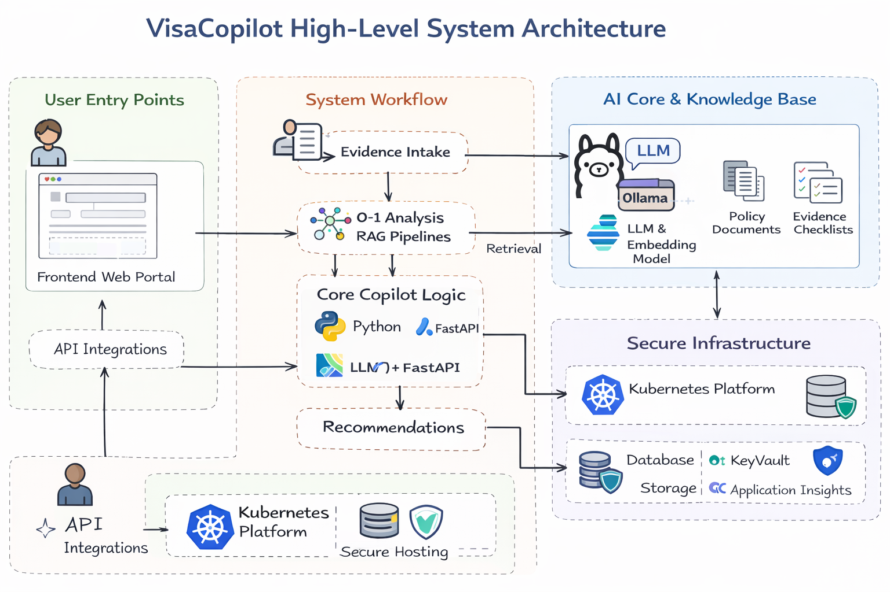

# VisaCopilot

AI-Powered Immigration Analysis System using RAG & LLMs

---

## 🚀 Overview

VisaCopilot is an AI-driven decision-support system designed to evaluate O-1 and H-1B visa eligibility by combining structured candidate data, Retrieval-Augmented Generation (RAG), and LLM-based reasoning.

The immigration process for high-skill visas is often complex, expensive, and unclear. Candidates lack a reliable way to assess their profile strength before investing significant time and legal costs. VisaCopilot addresses this by transforming unstructured immigration policies into actionable insights using AI.

The system integrates:

* 🧑‍💻 Structured Candidate Intake (Frontend UI)
* ⚡ FastAPI Backend (Orchestration Layer)
* 🧠 RAG Pipeline (Policy Retrieval + Context Injection)
* 🤖 Ollama LLMs (LLaMA / Mistral / Gemma)
* 🔎 Policy Knowledge Base (USCIS Documents)
* 📊 Explainable Scoring & Recommendations

The platform analyzes candidate profiles, maps them to USCIS criteria, retrieves relevant policy context, and generates a structured evaluation including readiness score, strengths, gaps, and next steps.

---

## 🏗 Architecture

---

## Methodology & Operations

The VisaCopilot system is designed as a modular AI pipeline focused on grounded reasoning, structured outputs, and continuous improvement.

* The workflow begins with a structured candidate intake via a React frontend, where user inputs are normalized into schema-aligned JSON mapped to USCIS O-1 criteria.
* A FastAPI backend acts as the orchestration layer, handling request flow, validation, and routing data across system components.
* A Retrieval-Augmented Generation (RAG) pipeline grounds the analysis using USCIS policy documents. Content is chunked, embedded, and retrieved at runtime to provide relevant context for each evaluation.
* The LLM layer (Ollama) performs controlled, prompt-driven reasoning, generating structured outputs aligned with policy requirements rather than free-form responses.
* A Copilot logic layer synthesizes results into actionable insights, including readiness score, strengths, gaps, and recommended next steps.
* The system includes feedback-driven refinement, enabling per-run improvements and global prompt optimization based on aggregated insights.
* The architecture is scalable and production-ready, supporting containerization, API-first design, and observability for reliable deployment.

This layered approach ensures the system is accurate, explainable, and extensible for real-world immigration analysis.
## 📌 Future Improvements

* Expand dataset with real-world immigration case outcomes for better evaluation

* Fine-tune LLMs on domain-specific immigration data for improved accuracy

* Enhance RAG pipeline with advanced chunking and hierarchical retrieval

* Add document upload and automated evidence extraction

* Introduce multi-visa support (EB1, EB2-NIW, etc.)

* Implement feedback loops for continuous learning and system improvement

* Deploy on cloud infrastructure (AWS / Azure) with secure access control

---

## ⚠️ Disclaimer

This system is intended for informational and decision-support purposes only and does not constitute legal advice. Users should consult an immigration attorney for official guidance.
